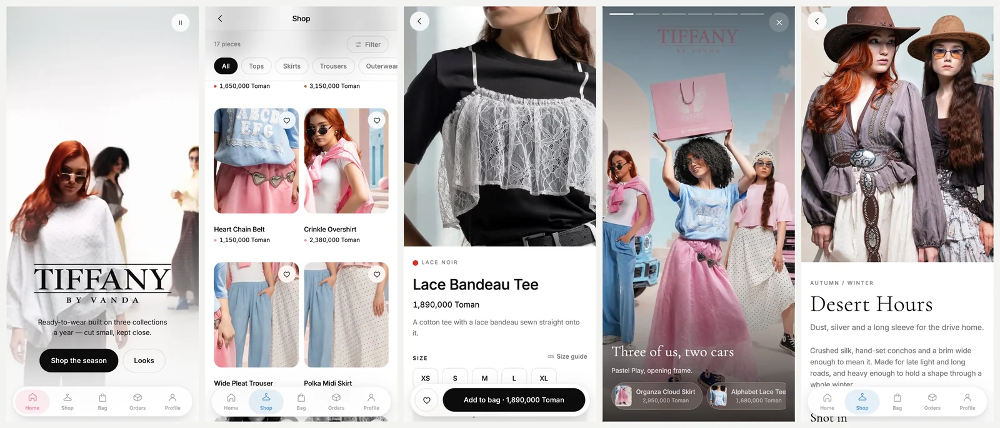

# TIFFANY by Vanda — shop preview

A black-and-white, installable storefront for **TIFFANY by Vanda**, women's
ready-to-wear, Iran. English throughout, iOS design language, built as a PWA so
it installs from Safari with no app store in the way.

Live: **https://ilyatabrizi.github.io/tiffany/**
Instagram: [@tiffanyiran](https://instagram.com/tiffanyiran)



---

## The idea

Two rules hold the whole design together.

1. **The interface is ink on paper.** No colour in the chrome — no coloured
   buttons, no coloured headings, no brand tint on a card.
2. **Colour belongs to the clothes.** Every photograph is greyscale at rest and
   comes to life when you reach for it.

On a laptop that means hover. A phone has no hover, so colour arrives a
different way: **whatever photograph is in the middle third of the screen is in
colour, and it drains as it leaves.** Scrolling the shop paints it. The one
exception is the campaign film and the look viewer, which are always in colour —
those are the brand talking, not the catalogue.

A visitor who disagrees can change it in Profile → Colour: *On touch*,
*Always*, or *Never*.

The five tabs each own one of five accents, and that accent is the only colour
in the chrome — it shows on the tab you are standing on, on a pressed button,
and on a hovered link. Home is blush, Shop sky, Bag cherry, Orders rust,
Profile lilac.

## What is in it

| Tab | What it does |
| --- | --- |
| **Home** | Full-bleed campaign film, the three collections, new in, the looks strip, an editorial block |
| **Shop** | 17 pieces, category chips in a sticky glass bar, a filter sheet for collection / size / sort |
| **Bag** | Line items with steppers, a free-delivery bar, a full checkout sheet that writes a real order |
| **Orders** | Order list with a live status, a five-stage tracking sheet, and a sample so an empty tab still demos |
| **Profile** | Saved pieces, orders, **Your fit**, delivery details, colour mode, light/dark, install |

Beyond the five:

- **The look viewer** — swipe six full-bleed campaign frames; every look carries
  the pieces it was shot in as glass chips that go straight to the product.
- **Your fit** — save bust / waist / hip once and every product page names the
  size the studio would hand you, adjusted for how that piece is cut.
- **Light and dark** — a black-and-white brand should invert cleanly, so it does.
  Auto follows the phone.
- **Installable and offline** — service worker, maskable icons, three shortcuts.

## Running it

```bash
python3 serve.py          # http://localhost:8131
```

```bash
python3 e2e.py            # 76 checks in a real browser, plus docs/shots/
```

`e2e.py` drives the system Chrome through Playwright — no browser download. It
walks every route, adds to the bag, checks out, tracks the order, opens the look
viewer, flips both appearance switches, and fails on **any** console error,
page error or failed request.

## Rebuilding the assets

```bash
python3 scripts/build_assets.py            # everything
python3 scripts/build_assets.py hero       # or one stage
```

Needs Pillow and imageio-ffmpeg. Stages: `photos`, `brand`, `icons`, `sig`,
`og`, `hero`, `sheet`. The last one writes `docs/contact-sheet.png` — a grid of every
crop, so framing gets checked rather than hoped.

What the studio sent, and what it became:

- **Six campaign frames** → 28 WebP crops at 480/960 (cards, collections,
  editorial) and 720/1080 (the full-bleed looks).
- **The wordmark** (transparent PNG) → white and ink versions, the app icons at
  180/192/512/1024, a maskable, a favicon, and the CSS mask used for the boot
  animation and the hero.
- **Alpha's own lockup** → split into two alpha masks, because it ships as white
  letterforms plus two yellow bars and would be invisible on paper. The letters
  take `--ink` and invert with the theme; the bars keep Alpha's yellow, the one
  colour on this site that is not TIFFANY's to spend.
- **A 22-second studio film** → a silent, 576-wide, 1.4MB H.264 loop trimmed to
  the clean middle (the master opens and closes on black flash frames) and faded
  through white at both ends, so the loop seam reads as a breath rather than a
  cut. Plus a WebP poster for Low Power Mode and reduced-motion.

The uncompressed 3.8MB master stays local — it is in `.gitignore`, not on the web.

## Structure

```
index.html            shell: boot veil, two glass bars, viewer, sheet root
css/app.css           one stylesheet, tokens first, light + dark
js/
  app.js              boot, routing, tabs, top bar, one click delegate
  router.js           hash router with a scroll memory
  store.js            one localStorage blob — bag, wishlist, orders, fit
  data.js             the catalogue (see the warning below)
  ui.js               cards, sheets, toasts, the size engine
  colour.js           the middle-of-screen colour observer
  hero.js             the campaign film, paused when out of view or hidden
  looks.js            the full-screen look viewer
  views/              home, shop, collection, product, bag, orders, saved, profile
scripts/build_assets.py
e2e.py
```

## ⚠️ Everything commercial is placeholder

The **photography is the studio's own**. Nothing else is.

Every product name, price, fabric, care instruction, measurement, delivery
time, returns window and the free-delivery threshold is copy written to make
the preview read like a real shop. The three collections — Pastel Play, Lace
Noir, Desert Hours — are named from the campaigns, not from the studio's own
line sheet. Product photographs are **crops of campaign frames**, not shot on
white; a real shop needs real product photography.

Replace `js/data.js` and `js/config.js` before this goes anywhere near a
customer.

Nothing here talks to a server. Checkout writes to `localStorage` and no card
is charged. Everything a visitor types stays on their phone.

## Deploying

The repo is the site — GitHub Pages serves `main` at root, `.nojekyll` is
there, `404.html` bounces deep links back through the hash router.

```bash
git add -A && git commit -m "…" && git push
```

Built by Alpha Agency.
